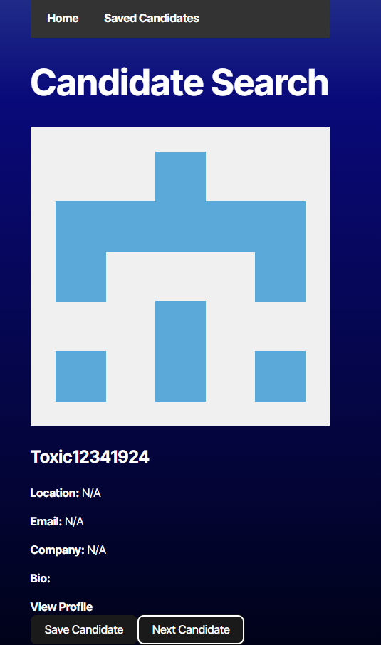
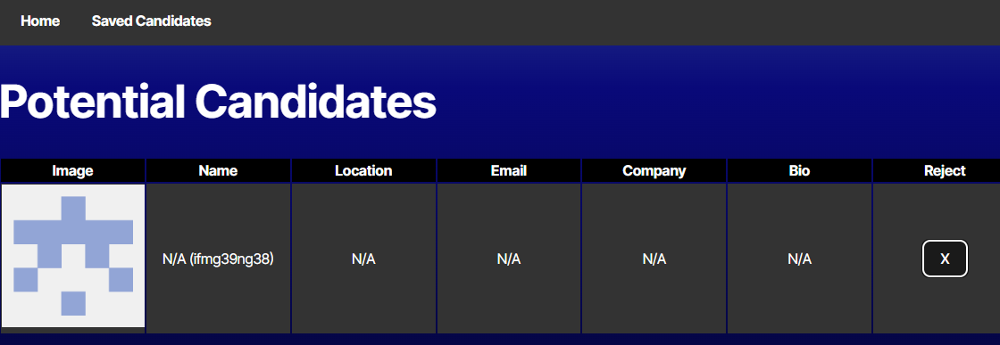

##  Features
-  **Candidate Search:** Retrieves real-time data from the GitHub API.
-  **Save Candidates:** Adds candidates to a list of potential hires.
-  **Reject Candidates:** Moves to the next candidate without saving.
-  **Saved Candidates List:** Displays saved candidates with an option to remove them.
-  **Persistent Data:** The list of saved candidates is stored in `localStorage`.

##  Screenshots

###  Main Page - Candidate Search

###  Saved Candidates List


##  TechnologyUsed
-  **React** with **TypeScript**
-  **Bootstrap** for styling
-  **GitHub API** for fetching candidates
-  **Local Storage** for storing saved candidates
-  **Deployed on Render** (upcoming step)

##  Installation and Usage
### 1️ Clone the repository
```bash
git clone https://github.com/YOUR_USERNAME/YOUR_REPOSITORY.git
cd YOUR_REPOSITORY
```
### 2️ Install dependencies
```bash
npm install
```
### 3️ Configure the API Key
Create a `.env` file in the root folder and add your **GitHub Token:**
```env
VITE_GITHUB_TOKEN=YOUR_TOKEN_HERE
```
### 4️ Run the project
```bash
npm run dev
```

## Links
-  **GitHub Repository:** [ View on GitHub](https://github.com/chicalauren)
-  **Render Deployment:** [ View on Render](#)

##  License
This project is licensed under the **MIT License**.
